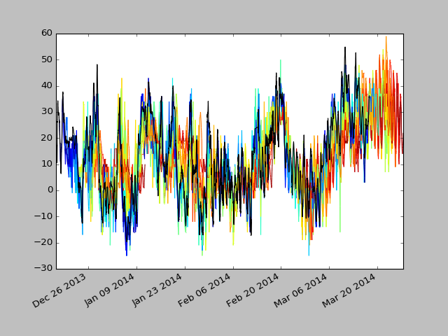
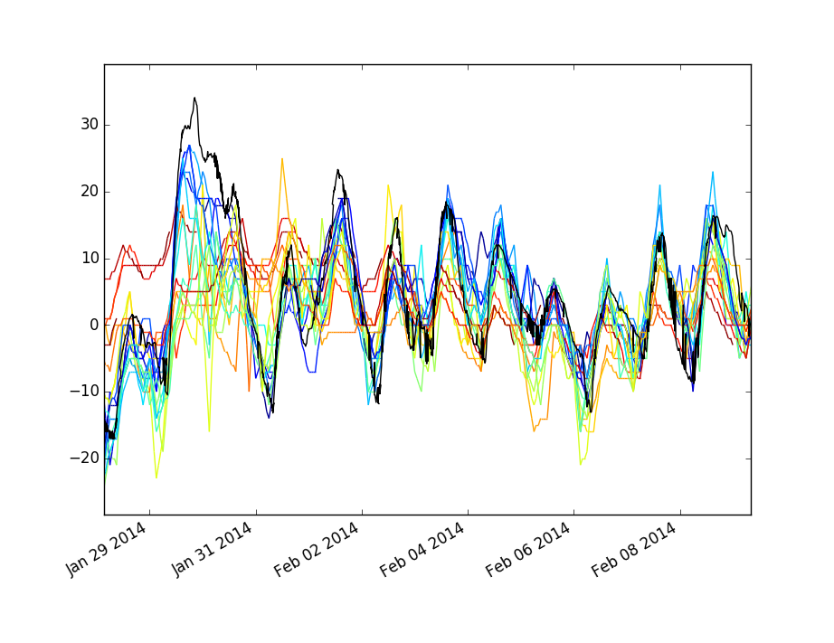

# Weather forecast accuracy tracking

This is a small project which collects 10 day weather forecast information
from the weather underground API and plots these predictions against
the actual temperature. This data is plotted via a `flask` app. Data
and forecasts are all for the Minneapolis/St. Paul airport. Only
the temperature forecast is recorded and compared.

## Requirements

Python 2, `matplotlib`, `mpld3`, `flask` and `numpy` are required.

## Fetching Data

`fd.py` and `wd.py` are Python programs which periodically
query the weather underground API. The temperature forecasts are stored
in the `data/forecast.*.txt` files and the actual temperatures are
stored in `data/data.txt`. The format for these files is lines of
time-stamps and temperature in Fahrenheit.

To use `fd.py` and `wd.py` a weather underground API key is needed.
This should be stored as a string in the environmental variable `KEY`.

## Plotting Data

`flaskapp.py` is a flask app which plots the forecasts against the
actual data.

giving the command: `$ python flaskapp.py` should start a local
web-server and you can see the results on the following pages:

`127.0.0.1:5000/png` serves a png file which shows the actual
temperature in black and the forecast temperatures colored according
to how old the forecasts are. Blue forecasts were made recently and red
forecasts were made 10 days ago.

An example of the data:

A zoomed in example:

`127.0.0.1:5000/d3/` is a rendering of the data using d3. It allows
interactive zooming and panning but is slow for large data sets.

`show_data.py` plots the data using matplotlib.
